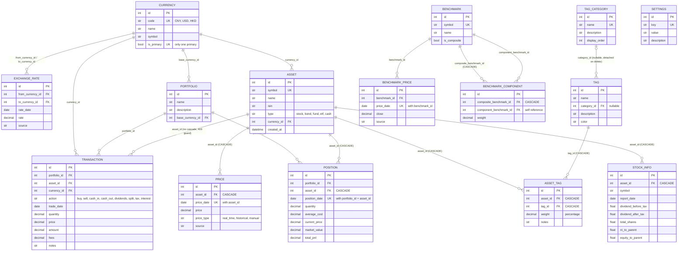

# Database Model Relationships

ER diagram of all SQLModel entities in `backend/db/models/`.

## Diagram

## Entity Overview

| Entity | Purpose |
| --- | --- |
| Currency | Multi-currency master data; exactly one primary currency |
| ExchangeRate | Daily rates: 1 unit of `from_currency` = `rate` units of `to_currency` |
| Asset | Tradeable instruments (stock, bond, fund, etf, cash). Cash assets use the `{CCY}_CASH` symbol convention |
| TagCategory | Tag groupings (行业 / 地域 / 资产类型 / 风格) |
| Tag | Individual tags, optionally grouped in a category |
| AssetTag | Asset-to-tag assignment with a weight (%) per category |
| Portfolio | Top-level container with a base currency |
| Transaction | All money/share flows: buy, sell, cash_in, cash_out, dividends, split, tax, interest |
| Position | Daily portfolio position snapshot per (portfolio, date, asset) |
| Price | Asset price history per (asset, date, type) |
| StockInfo | Per-stock financial indicators from THS |
| Benchmark | Benchmark index, optionally composite (weighted components) |
| BenchmarkPrice | Benchmark index price history |
| BenchmarkComponent | Composite benchmark membership and weights |
| Settings | Standalone key-value application settings |

## Delete / Cascade Behavior

| Delete target | Behavior |
| --- | --- |
| Asset | Blocked with 409 if transactions exist. Otherwise cascades to `asset_tags`, `prices`, `positions`, `stock_infos` (ORM cascade + FK `ON DELETE CASCADE` on fresh databases) |
| Tag | Cascades to its `asset_tags` |
| TagCategory | Tags are detached (`category_id` set to NULL, become "Uncategorized") |
| Benchmark | Cascades to `BenchmarkComponent` (composite side). Known gap: `BenchmarkPrice` rows are **not** cascaded and will raise an integrity error if present |
| Transaction | No children; direct delete. Note: deleting transactions does **not** recalculate or clean up existing Position snapshots |
| Portfolio / Currency | No delete endpoints |

## Notes

- FK `ON DELETE CASCADE` is declared in the models (sqlmodel `Field(ondelete="CASCADE")`). SQLite only enforces it when `PRAGMA foreign_keys=ON`, which `backend/db/base.py` enables on every new connection.
- ORM-level `cascade="all, delete-orphan"` works on existing databases immediately. The FK-level DDL only applies to tables created afterwards (i.e. after `python -m backend.init_data`).
- `Transaction.asset_id` deliberately has no cascade: assets with transactions cannot be deleted (409).
